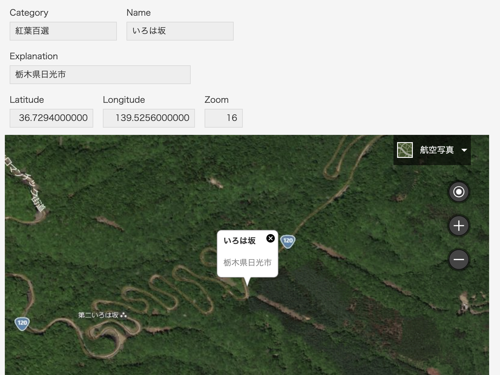

# kintone-bingmaps
kintoneにある緯度経度データをもとに、Microsoft Bing Maps APIを利用して地図を描画する。

## 「kintoneカスタマイズビュー」での完成イメージ

|レコード一覧（カスタマイズビュー）|レコード詳細|
|---|---|
|||

## 主な仕様
- カスタマイズビュー機能を使って、左ペインに地図、右ペインにリストを作成
- 緯度経度の座標を元に地図を描画する
- Nameのリンクをクリックすると地図が変わる
- 右ペインの矢印（→）アイコンをクリックするとレコードの詳細に移動する
- レコード追加/編集画面で、緯度経度、縮尺値などを変更できる
- レコード詳細画面で地図を描画する
- PC版のChrome, Firefoxのみ確認済

## 適用方法の情報
- [Microsoft Bing Maps APIの取得方法](https://docs.microsoft.com/ja-jp/windows/uwp/maps-and-location/authentication-key)
  - [取得ページ](https://www.bingmapsportal.com/)
- kintone環境の準備
  - [kintone開発環境](https://developer.cybozu.io/hc/ja/articles/200720464)
  - [kintone試用申し込み](https://kintone.cybozu.co.jp/trial/)
- サンプルデータのインポート
  - [サンプルCSV](data.csv)
  - [CSVファイルからアプリ作成](https://jp.cybozu.help/k/ja/user/create_app/app_csv/add_app_csv.html)
- [カスタマイズビューの作成](https://jp.cybozu.help/k/ja/user/app_settings/view/set_view.html#view_set_view_2030)
- [JavaScriptファイルの読み込み方法](https://jp.cybozu.help/k/ja/admin/javascript_fullcustomize.html)

## Bing Maps Document
- [Bing Maps Documentation](https://docs.microsoft.com/ja-jp/bingmaps/)
